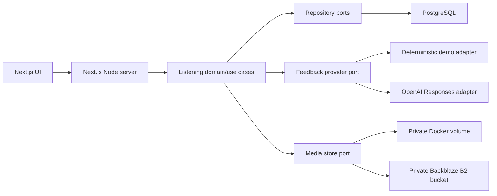

# Architecture

## Runtime shape



The first release is a modular monolith. A single Node process keeps deployment
and classroom setup small while domain boundaries keep later rhizomes possible.

Remote media is authorized by the application but delivered directly by object
storage through a short-lived signed URL. This keeps credentials and activity
authorization server-side without routing classroom playback through the
application host's uplink.

## Source layout

```text
src/app/                 Next.js routes, pages, and server actions
src/domain/              framework-free entities, schemas, and invariants
src/application/         use cases and port definitions
src/adapters/db/         PostgreSQL persistence
src/adapters/feedback/   demo and OpenAI provider adapters
src/adapters/media/      local and S3-compatible private media adapters
src/components/          UI only
scripts/                 migration and safe seed commands
migrations/              append-only SQL
```

Dependency direction is inward: adapters depend on application/domain
contracts; domain code never imports an adapter or framework.

## Activity-package boundary

`listening-activity-package.v1` is the operator/teacher import boundary. Its
required fields remain stable while question kinds, source metadata, timed
segments, and extension maps can vary by source. Importing is additive: a new
package version creates a new `activity_version`; existing attempts remain
pinned to their original version.

## Stored invariants

- Activity versions own exact transcript, teacher guide, prompt, playback mode,
  and media reference.
- Publishing freezes the active activity version. Editing creates a new version.
- Attempts point to one immutable activity version and one learner.
- Each retry creates a higher attempt number and may reference its predecessor.
- Feedback is a separate append-only record with provider, model, prompt
  version, contract version, and status.
- No universal score columns exist. A future game capability must use separate
  tables and DTOs.
- Pseudonyms are scoped to an activity and are not used for authentication.

## Feedback boundary

The complete runtime path, exact provider payload and latency controls are
documented in `docs/AI_FEEDBACK_PIPELINE.md`.

Input contract `listening-review-input.v1` contains only the current activity
version, teacher guide, current attempt, and optional previous reconstruction.
Output contract `listening-feedback.v1` is validated before persistence:

```ts
type BilingualText = { en: string; id: string };

type ListeningFeedback = {
  contractVersion: "listening-feedback.v1";
  summary: BilingualText;
  observations: Array<{
    kind: "captured" | "unclear" | "reconsider" |
          "newly_noticed" | "insufficient_evidence";
    message: BilingualText;
  }>;
  nextListeningTarget: BilingualText;
};
```

There is intentionally no score, percentage, grade, level, or transcript quote.
The server adds provenance; the provider does not author its own identity,
timestamps, hashes, or attempt linkage.

## Security and privacy

- Passwords use a memory-hard hash through the identity adapter.
- Session tokens are random, stored as hashes, `HttpOnly`, `SameSite=Lax`, and
  `Secure` outside local development.
- Every activity, attempt, and media read is authorized server-side.
- Uploaded audio is private and receives generated filenames; original names
  are display metadata only.
- Logs contain identifiers, timing, status, and safe error codes—not learning
  content or secrets.
- OpenAI calls use the Responses API with structured output and `store: false`.
- Provider failure retains the submitted attempt and records a retryable,
  content-free failure state.

## Failure policy

Database failure blocks a write. Media failure does not create a published
activity. AI failure never loses an attempt and never substitutes invented
feedback. The demo adapter is selected explicitly by configuration and its UI
provenance is visible; it is not a silent fallback from a failed live provider.

Production public-media mode is defined by D-014. Its neutral storage configuration
uses OBJECT_STORAGE_* and PUBLIC_MEDIA_BASE_URL; legacy B2_* aliases remain.
Authorized media routes redirect to the public origin without proxying bytes.

## Recreational classroom boundary (LFL-007)

The game domain defines versioned deck/view contracts, phase progression and
bounded game points. RoomPort connects it to the PostgreSQL room adapter.
Next.js handles identity, cookies, same-origin validation and transport.
Classroom tables are separate from the individual listening evidence graph.
Only the teacher receives audio playback URLs; student DTOs gate options and
answer/cue reveal by phase. Two-second polling recovers current authoritative
state after reconnect; the teacher speaker is the single audio clock.
See D-015 and CLASSROOM_GAME.md for privacy, moderation and pilot limits.

### Complete listening journeys (LFL-021)

`listening-ladder.v4` adds ordered passage metadata. New `passage-route.v1`
content partitions a flattened immutable item list into recordings. The domain
reducer scopes choices and repairs to the current passage. An acknowledged,
idempotent `continue` event changes the passage only after bounded replay or
supported review has closed it; earlier actions remain intact. Variable
`chapter-route.v2` maps contain executable connectors for three to five items.

Migration 014 adds nullable recording-version lists to runs and classroom
sessions. All versions are resolved and checksum-checked before start; joins
inherit the session list. Current publication pointers cannot retarget saved
recordings. Historical single-recording content readers remain registered.
The teacher DTO exposes passage locations and route transitions, while learner
explanations and answer material remain outside projection. No new service or
scoring path is introduced.

## Teacher release and pre-game profiles (LFL-022)

`listening-ladder.v5` adds setup/waiting/playing lobby metadata. New sessions
require an owned teacher start; new runs require personal readiness. Public
recording URLs/questions are withheld before both gates, and writes enforce
them. Existing sessions/runs migrate as started/ready. Each run pins its
character and colour; profile changes are recorded before readiness and locked
afterward. Completion returns to an ownership-checked dashboard recap.
