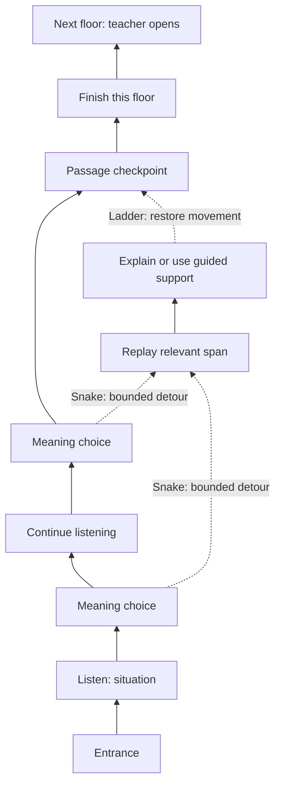

# Guided listening ladder — discussion draft

Work ID: LFL-015. Prepared 2026-10-06 (Asia/Jakarta).
Status: planning only; proposed rules require discussion and classroom trial.
No application code, media import, published activity or deployment changed.
This is a design review against learning, fairness and operational failure modes,
not independent peer review or classroom validation.

## Aim and scope

An individual audio activity where learners build a tentative interpretation,
choose between plausible meanings, replay relevant spans after mismatches,
and explain or demonstrate a revised interpretation. Snakes and ladders make
those actions visible. The teacher can display classroom game progress.

Bootstrap one carefully authored passage. Defer general import tooling and video
support. Preserve original media, source privacy, bilingual guidance, immutable
attempts and provider independence. No score, ranking or proficiency judgment
in instructional history. Board position is explicitly recreational game state,
not a measure of understanding. Any competitive display belongs only to that
game capability; use checkpoint groups rather than numbered ranks by default.

## Material inventory and why only one activity

Read-only local inspection found five shared passages covering source questions
31–50: two conversations (97.116 and 99.036 seconds) and three talks (103.886,
87.035 and 85.570 seconds). The numbered files also exist, but should not be
assumed to be distinct full passages: inspect their contents before use.
The source/deployment records document only the first conversation as an
individual practice activity, plus a separate classroom game for 30 short clips.
This explains the documented single individual activity; a current production
catalog query was not performed during planning.

The first pilot uses the existing conversation. Remaining four passages are
content backlog, not already authored guided activities. Source identifiers,
original filenames and question numbers stay out of learner-visible titles,
URLs and media labels. Do not copy those identifiers into new public materials.

## Proposed round

1. Introduce the situation neutrally, without disclosing its resolution.
2. Offer a brief whole-passage listen for gist, skippable in a repeat session.
3. Guided listen: one short question with three or four balanced options at a
   time. Preview a short prompt before the relevant span. Options can be clicked
   while listening; selections remain tentative until the learner confirms.
4. Auto-pause at a reviewed phrase/discourse boundary. Keep options available
   without a countdown. Never require reading a paragraph while tracking speech.
5. Record first choice and media state. A matching choice advances the token;
   a mismatch opens a repair task and creates one bounded snake movement.
   'Not sure yet' opens repair without a punitive slide.
6. Finish the passage; consolidate repair tasks at the checkpoint. Let learners
   voluntarily replay immediately, without requiring a long explanation that
   causes them to miss the next part of the conversation.
7. Replay contextual spans, then ask for a revised meaning in a short response.
8. Clear each task through an independent or assisted route. Open a checkpoint
   with a visible recap of changed interpretations. Do not infer mastery.

Prototype starting assumptions: four authored meaning checkpoints, at most four
repair tasks, and about 6–10 minutes per passage. These are timing targets to
validate, not claims about classroom duration. Merge duplicate repair tasks
when several choices concern the same misunderstanding. Do not manufacture
extra questions merely to fill the board.

## Bounded snakes, meaningful ladders and guaranteed exit

- Board tiles indicate game movement, never 'percent understood'. Use a finite
  floor per passage, approximately 12 tiles as a visual starting point.
- One snake per distinct unresolved task; slide at most two decorative tiles,
  never below the floor's entrance and never across a completed checkpoint.
- Earlier cleared tasks stay cleared. Repeated difficulty with the same task
  produces more support, not more backward movement or new repair debt.
- A completed repair restores its displaced movement and provides a short
  ladder animation. Reconsidering an interpretation can therefore feel useful.
- Ladders cannot bypass an unresolved learning task. No die rolls, stolen moves,
  player attacks, paid perks or unrelated random knowledge penalties.
- Logical state is monotonic: unresolved -> revised or supported_review or
  teacher_closed. Board animation may move backward; durable cleared tasks do
  not. Compute movement from saved events to avoid double advancement on retry.
- After one replay/explanation attempt, offer a targeted cue. After a second
  unsuccessful or ambiguous attempt, offer a guided explanation using a short
  transcript excerpt, followed by a simple restatement/application prompt.
- Supported review closes the game task without asserting independent
  comprehension. Do not expose its status as a public label or rank penalty.
- If still stuck, learner can request teacher help or pause/resume. The teacher
  can close the task with a recorded reason. No learner is trapped by an AI
  judgment; no absolute comprehension guarantee is possible.
- AI outage does not block the destination: a prepared teacher-authored cue and
  supported-review route remain available. At lesson end the teacher may end
  play; do not fabricate completed tasks for absent/paused learners.

## Explanation and feedback contract

Choices use a teacher-approved key. AI never decides whether a multiple-choice
selection matches the key. Explanations use a narrow item-specific meaning
rubric and acceptable paraphrases; spelling, Indonesian/English choice and
writing sophistication are not the goal. Accept brief mixed-language responses
and accessible guided alternatives. Generic prose alone is not proof of meaning.

AI response states: meaning supported; a particular mismatch; unclear/needs
help. Every state offers one bounded next action. Ambiguous cases cannot
produce an unlimited gate. Record original explanation and feedback immutably;
retries create new events. Do not publish learners' explanations to the class.

Hints before supported review cannot reveal the key in paraphrase. Once the
assisted route is explicitly chosen, a bounded reveal is honest teaching,
not covert answer leakage. Use one prepared contrast or short excerpt, rather
than displaying the whole transcript. A later fresh, unassisted prompt may
check transfer, without changing earlier outcomes or creating a public grade.

## Option quality

Each item targets one main meaning relationship. Use three options when only
two credible distractors exist; four is not mandatory. Options have comparable
length, grammatical form, specificity and reading difficulty. Avoid repeated
word matches, conspicuously detailed keys, trick negatives, 'all of the above',
partly defensible distractors and cultural knowledge not contained in the audio.

Useful distractor patterns: correct detail attached to the wrong speaker;
original problem mistaken for proposed solution; mentioned possibility mistaken
for adopted plan; reversal of cause/effect; plausible but unsupported inference.
Document why each distractor is wrong and which span resolves it. Human review
must confirm one defensible key. Shuffle positions once per learner/item and
keep them stable during repair. Later repair should require meaning, not simply
clicking the memorized key. First-pass supported choices are not independent
listening evidence.

## Timestamp and media plan

Store integer millisecond boundaries against an immutable audio checksum, even
though actual browser seek precision is not guaranteed to be one millisecond.
Use media time, not wall-clock timers, for cues. Pausing, buffering, changing
playback rate, seeking and backgrounding the tab must not create missed tasks
or penalties. Seeking does not resolve a gate; it also does not erase progress.

Each item needs: reveal/preview time, contextual replay start/end, optional tight
focus start/end, relevant transcript turns, key, distractor reasons, acceptable
meanings, bilingual cues, and the supported-review explanation. Long-distance
inferences may need two contextual spans rather than one tiny cut.

Manually align the pilot against the exact audio. Listen to every cut, include
pronoun antecedents and enough preceding context, avoid clipping word onsets,
and stop at a natural boundary. Forced alignment/ASR can draft timings later,
but cannot replace review. Initial device target: cues near reviewed boundaries
without audible clipping, tested across desktop/phone. Distinguish stored time
precision from actual playback accuracy. No fabricated timestamps in this plan.

## Fair support and randomness

Learning help is available to everybody. Additional offers depend on current
friction (repeated unresolved task or request for help), not public bottom rank,
prior grades, speed or inferred ability. A slow device/listener may need more
time without needing easier meaning. Do not label anyone a low achiever.

Recommended useful aids: contextual replay; one smaller focus cue; a simpler
response format; one distractor explained during supported review; prevention
of an additional decorative slide (already bounded). Support never subtracts
recognition or prevents checkpoint completion.

Randomness selects the presentation or choice among equally useful available
helpers/cosmetic effects. Necessary support has a guaranteed offer and a manual
request button. Do not make learning help a lottery. Publish the general rule:
'Everyone can ask for help; the game offers more support when a task gets stuck.'
Never secretly alter the answer key, fake rankings or give instant task clears.
If aids materially change progress conditions, do not claim a comparable
fastest-listener result. An assisted fun race is acceptable only with honest
rules and no grades, privileges or consequential rewards attached.

## Teacher display and expandable ladder

Student default: own token, current floor and checkpoint. Public classroom
screen: game aliases/avatars grouped by floor/checkpoint, no numbered ranks,
wrong-answer counts, repair labels, help usage or inferred proficiency. Tokens
and colors cannot require color vision; movement has a reduced-motion option.
Teacher private view: current checkpoint, listening/reviewing/paused/connection
issue/help request, and teacher close controls. Keep original explanations
private and available only to authorized teacher inspection when needed.

The ladder is extensible, not literally an endless required session. Teacher
sets a visible session goal and opens the next floor at a checkpoint; never
moves the current finish line without notice. Completed students can do an
optional extension while classmates finish. Rest/stop at checkpoints. A teacher
can open the next floor without waiting for every learner, leaving previous
floor available for supported completion. Race timing includes neither network
failure nor imposed wait; do not offer speed bonuses in the pilot.

## Operational holes and safeguards

- Resume/reload/disconnect: server persists owned game events and unresolved
  tasks. Duplicate requests and concurrent tabs cannot duplicate movement.
- Connection/provider problem is a technical pause, never an incorrect answer.
- Browser cannot receive hidden keys, unrevealed hints, transcript or other
  learners' private answers; server checks choices/permissions.
- A learner can guess or get help from another learner. Explanation and later
  novel prompts reduce shallow completion, but do not eliminate it; no invasive
  surveillance or false promise of cheat prevention.
- Tiny spans can destroy discourse meaning; offer wider context/full replay.
- Too many mid-audio controls split attention; board remains still during audio,
  animations occur at pauses, options stay concise and only one item is active.
- Teacher dashboard can expose slow learners; use aliases, optional individual
  hiding and checkpoint grouping. Some aliases are still identifiable in class;
  privacy requires display choice, not anonymity claims.
- Fast finishers need optional further listening, not influence over others'
  gates. Devices need headphones for individual playback.
- Ambiguous/bad items have a teacher neutral-close action and revision for future
  sessions. Existing activity versions and event history remain immutable.
- AI latency could erase engagement gains: requests occur during paused repair,
  with clear saved states, prepared fallback and no fabricated progress.
- Repeated aid use is not misconduct. Make recovery possible without deliberate
  wrong answers becoming a faster shortcut through material.
- Accessibility: keyboard/touch operation, uncluttered mobile view, readable
  options, bilingual guidance, no audio countdown, configurable rate and safe
  caption support. Caption-assisted listening is a valid supported route but
  not claimed as audio-only independent understanding.

## Prototype and acceptance gates

First prepare a paper/slide simulation, exact reviewed spans and four items for
one conversation. Walk it through: all matching choices; all mismatches; repeated
mismatch; ambiguous explanation; 'not sure'; help request; provider failure;
network pause; teacher session close; fast finish; accessibility needs.

Before code approval, settle timing, bounded snake behavior, explanation exit
and public display. Pilot with a small varied learner group. Check whether they
listen with a specific purpose, explain a revised relationship, tolerate repair,
reach a stopping point, and want another passage. Ask explicitly if projected
progress feels exposing or unfair. Observe fresh-clip meaning without displaying
scores. Do not equate board completion with learning or one exciting lesson with
sustained motivation. Revise rules before expanding the remaining passages.

Defer general import UI, video, seasons, badges, elaborate scoring, automated
alignment and broad analytics. Keep only a minimal content worksheet/model so
bootstrap work is not thrown away: stable item IDs, audio hash, millisecond spans,
options/key/reasons, repair rubric/hints and versioned bilingual text.

## Research basis and limits

- Vandergrift & Tafaghodtari (2010): process-guided listening with prediction,
  monitoring and purposeful revisiting; supports the instructional loop, not
  the proposed board mechanic. https://doi.org/10.1111/j.1467-9922.2009.00559.x
- Wang & Tahir (2020), review of 93 Kahoot studies: benefits plus time stress,
  guessing under speed rewards and fear of losing. No claim that every game
  creates those problems. https://doi.org/10.1016/j.compedu.2020.103818
- Hanus & Fox (2015), a 71-student longitudinal course comparison: negative
  motivation/satisfaction findings in that gamified design. Not proof that all
  leaderboards fail. https://doi.org/10.1016/j.compedu.2014.08.019
- Sailer & Homner (2020): positive average gamification effects with contextual
  variation; does not validate this ladder or hidden catch-up boosts.
  https://doi.org/10.1007/s10648-019-09498-w

Bounded recovery, transparent support rules and grouped progress are design
judgments informed by these findings. The exact game requires classroom review.

## Board concept (illustrative, no finalized tile mapping)

The actual view is a serpentine board with short snakes and ladders. This diagram
shows logical routes only. Repair can be queued until the passage ends; drawing
it below the path does not mean interrupting every first-listen choice. Finish
requires all distinct queued tasks closed independently or through support.
